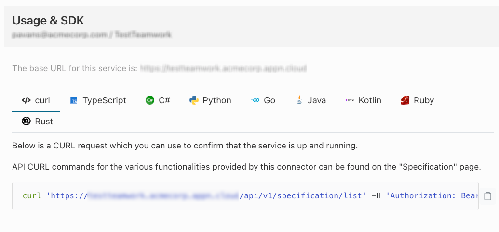

# Getting Started with the Kosha SDK in Go


##### What you'll learn
- [x] How to interact with the Kosha user interface to obtain the client library in Golang
- [x] How to add the Kosha client library to your project
- [x] How to programatically connect to a Kosha endpoint using the client SDK 

## Installation

##### Download the SDK
1. Navigate to **My Connectors** in the Connectors tab and click into your connector of choice.
2. Click into Usage & SDK
3. You should see this screen with a variety of language options presented. 

4. Click on Go and select the option to download its SDK.


##### Install Into Project
1. Unzip the Go SDK into your project 
```sh
tar -xvf <generated_client>.zip -C <your_project_directory>
```

2. Navigate to the `go-client` library and edit the `go.mod` file

Change the go module to `module github.com/kosha/go-sdk`

Run the following commands:

```sh
go get github.com/stretchr/testify/assert
go get golang.org/x/oauth2
go get golang.org/x/net/context
```

Overall, your go-client `go.mod` should look something like this:

```sh
# cat go.mod

module github.com/kosha/go-sdk

go 1.13

require (
	cloud.google.com/go v0.65.0 // indirect
	github.com/stretchr/testify v1.8.3 // indirect
	golang.org/x/net v0.10.0 // indirect
	golang.org/x/oauth2 v0.8.0
)

```

3. Download all go client dependencies


```sh
go mod download
```

##### Import and Configure

Navigate to your app, and import the `go-client` module like so:

```go
package main

import (
	"fmt"
	"github.com/kosha/go-sdk/openapi"
)

func main() {
	cfg := &openapi.Configuration{
		DefaultHeader: make(map[string]string),
		UserAgent:     "OpenAPI-Generator/1.0.0/go",
		Servers: openapi.ServerConfigurations{
			{
				URL:         "https://<your_connector_name>.<your_company>.dev.kosha.app",
				Description: "Connector",
			},
		},
		OperationServers: map[string]openapi.ServerConfigurations{},
	}
	// add your kosha jwt token as a header
	cfg.AddDefaultHeader('Authorization', 'Bearer ' + '<paste-your-jwt-token-here>');

	client := openapi.NewAPIClient(cfg)
	res := openapi.<endpoint>{
		ApiService: client.<your-api-service>,
	}
	_, response, err := res.Execute()
	if err != nil {
		fmt.Println("error: %v", err)
	}
	fmt.Println(response)
}

```
