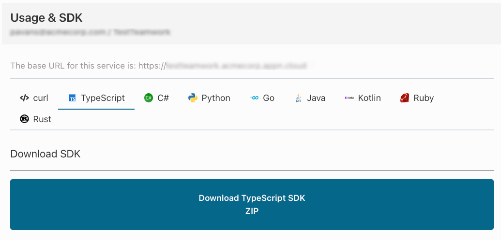

# Getting Started with the Kosha SDK in Typescript

Kosha provides you with a SDK in a variety of languages to get your connectors integrated into your code and processes with minimal toil. Each connector has its own SDK as a collection of client libraries for the connector API. Using this SDK will allow for faster development and cleaner code.  

##### What you'll learn
- [x] How to interact with the Kosha user interface to obtain the client library
- [x] How to add the Kosha client library to your project
- [x] How to programatically connect to a Kosha endpoint using the client SDK 

## Installation

##### Download the SDK
1. Navigate to **My Connectors** in the Connectors tab and click into your connector of choice.
2. Click into Usage & SDK
3. You should see this screen with a variety of language options presented. 

4. Click into your language of choice and select the option to download its SDK.


##### Install Into Project
1. Unzip the SDK into your project 
```sh
tar -xvf <generated_client>.zip -C <your_project_directory>
```

**_NOTE:_** There is no need to modify code in the client library.

2. Install into pip via the Setuptools based setup.py script

For a specific user:
```sh
npm install
```
For all users:
```sh
node ./main.js or npm run start
```

##### Import and Configure

```javascript
import serviceGateway from './path/to/service/gateway';
 
serviceGateway.init({
  url: 'https://service.com/api', // set your service url explicitly. Defaults to the one generated from your OpenAPI spec
  getAuthorization // Add a `getAuthorization` handler for when a request requires auth credentials
});
 
// The param 'security' represents the security definition in your OpenAPI spec a request is requiring
// For bearer type it has two properties:
// 1. id - the name of the security definition from your OpenAPI spec
// 2. scopes - the token scope(s) required
// Should return a promise
function getAuthorization(security) {
  switch (security.id) {
    case 'account': return getAccountToken(security);
    // case 'api_key': return getApiKey(security); // Or any other securityDefinitions from your OpenAPI spec
    default: throw new Error(`Unknown security type '${security.id}'`)
  }
};
 
function getAccountToken(security) {
  const token = findAccountToken(security); // A utility function elsewhere in your application that returns a string containing your token – possibly from Redux or localStorage
  if (token) return Promise.resolve({ token: token.value });
  else throw new Error(`Token ${type} ${security.scopes} not available`);
}
```

### The world is your oyster!
Now that you've implemented one endpoint for one connector, you can implement any other endpoint in any other connector within Kosha. The process is universal across connectors and allows for clean, consistent code across your applications.

